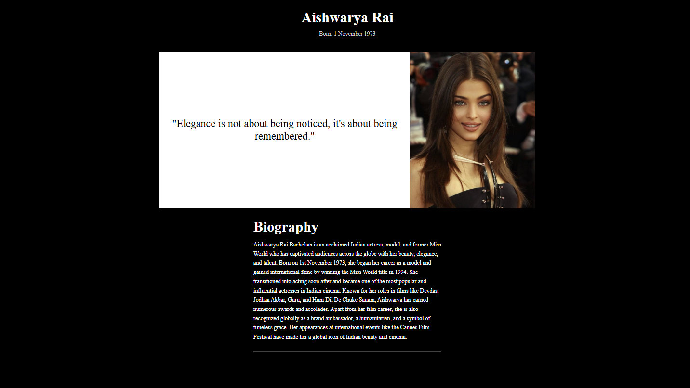

# OIBSIP_WebDevelopment_Task2
Task 2 of level 2 under Oasis Infobyte Internship Program
[ Tribute Page (Aishwarya Rai) ]

##  Objective
Created a simple and beautiful tribute page using HTML and CSS to honor someone i admire. The page included have meaningful text, a structured layout, an image, and customized styling.

## Tools Used
- HTML5  
- CSS3  
- Visual Studio Code  

## Steps Performed
1. Created a semantic HTML structure with `header`, `main`, and `footer`.
2. Wrote a tribute paragraph about Aishwarya Rai describing her achievements and qualities I admire.
3. Added an image of Aishwarya Rai for visual appeal.
4. Styled the layout using CSS:
   - Chose a beautiful font combination
   - Applied background and text color schemes
   - Centered and spaced out sections for better readability
5. Ensured that the page is visually appealing and responsive.

## Outcome
A tribute webpage with:
- A headline and subheading
- A photo of Aishwarya Rai
- Paragraphs describing her career and personality
- Customized fonts and background color for aesthetic impact

## Screenshot

## Demo Video:
👉 [Click here to watch the demo on YouTube](https://www.youtube.com/watch?v=4zqQz5QO08k)
